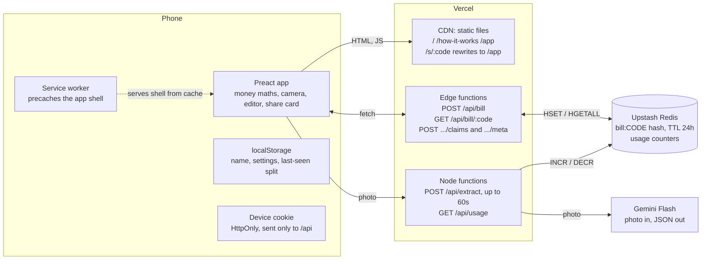
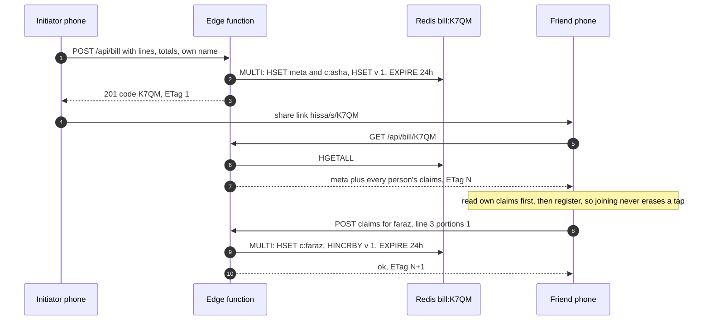
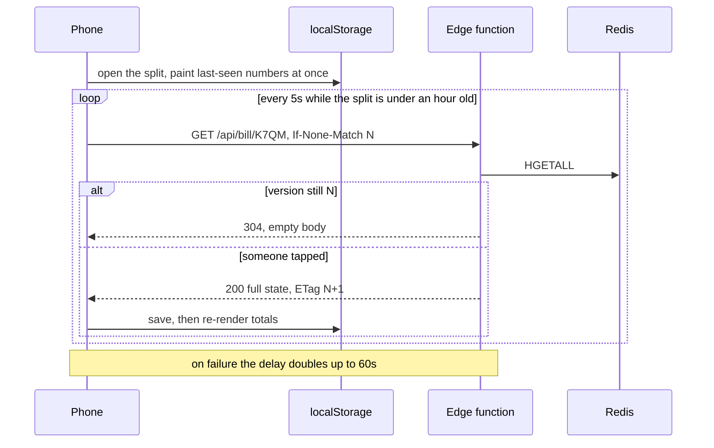
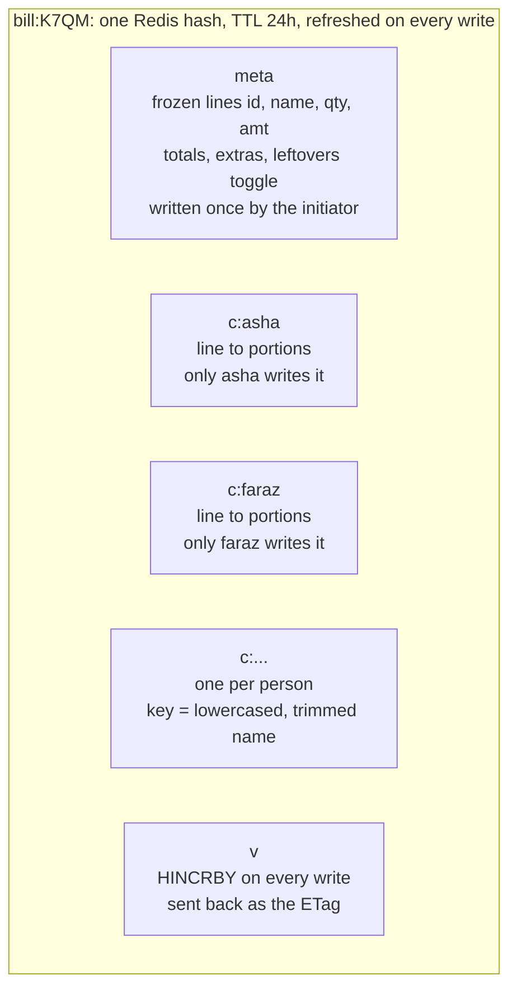
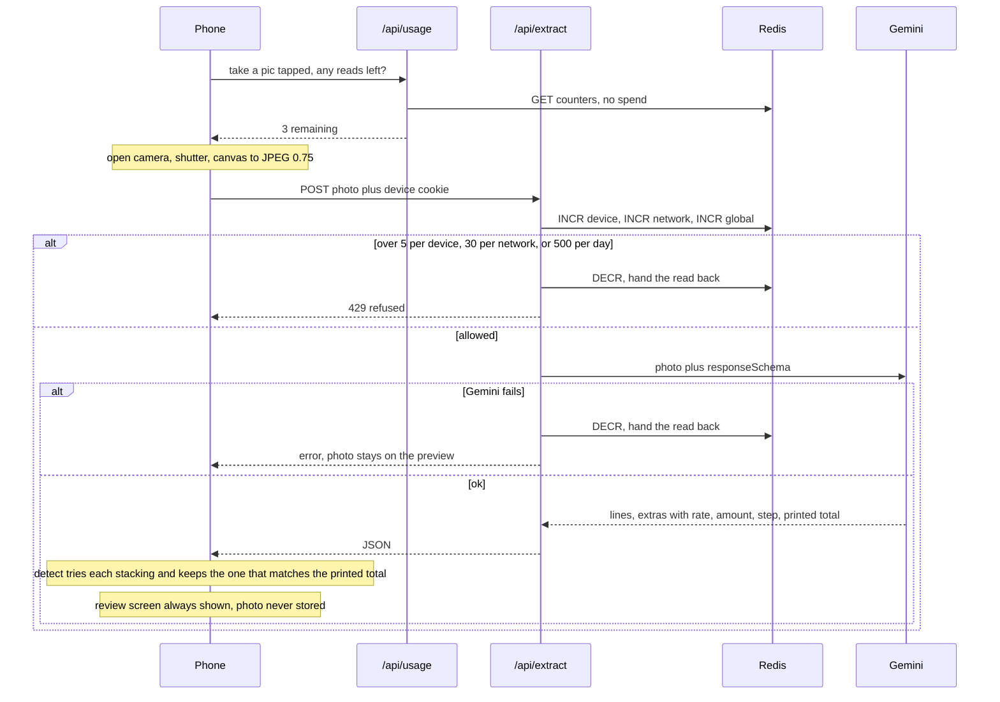
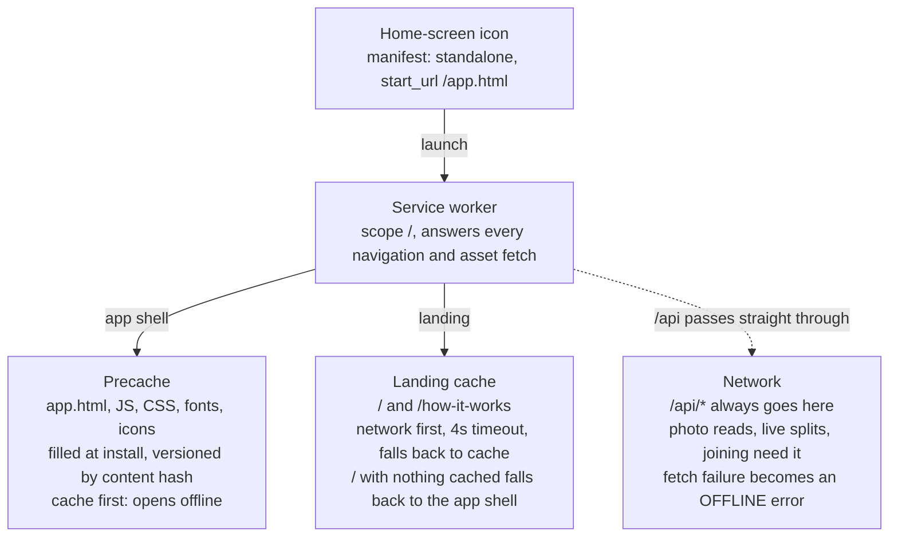
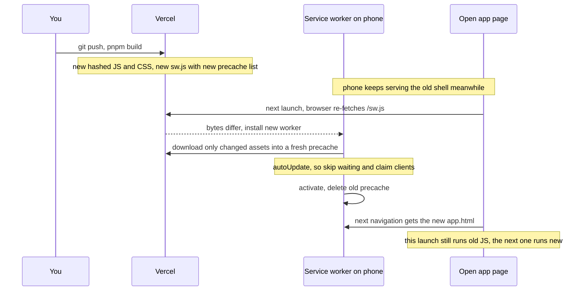

# How Hissa fits together

A static shell on a CDN, four small serverless functions, one Redis hash per bill, and a service worker that keeps the app alive on a phone. Nothing here holds a session, an account or a socket.

[The system](#the-whole-system) · [Sharing a split](#starting-and-joining-a-split) · [Polling](#keeping-everyones-numbers-current) · [Reading a photo](#reading-a-bill-from-a-photo) · [On the phone](#how-the-app-lives-on-a-phone) · [Updates](#how-an-update-reaches-a-phone) · [Offline](#what-works-without-a-connection) · [Glossary](#glossary)

The invariants and the reasons behind the design are in [`CLAUDE.md`](../CLAUDE.md); this page only shows how the parts connect.

## The whole system

Three things run in the phone: the page, a [service worker](#g-sw) between the page and the network, and `localStorage`. Everything that costs money or must be shared goes through `/api`. Redis is the only database, and the only thing Gemini ever sees is one resized photo.

The phone reaches Vercel through two doors: the CDN for files, and `/api` for data. Only the Node function can reach Gemini, and it also counts reads in Redis before it spends one.

- **Why polling, not sockets.** The spec asked for a Durable Object and WebSockets. The build uses [ETag](#g-etag)-gated [polling](#g-polling) on serverless, which needs no long-lived connection and costs one tiny Redis read when nothing changed.
- **Why two runtimes.** Bill endpoints are short and run as [edge functions](#g-edge). A Gemini read can take longer than Edge's 25s first-byte limit, so `/api/extract` runs as a [Node function](#g-node) with a 60s budget.
- **Why no accounts.** A person is a normalised name inside one split. Rejoining from a second phone is typing the same name.

## Starting and joining a split

The initiator writes the bill once. After that, each person writes only their own field, so eight people tapping at once never write the same thing. Every write bumps a [version counter](#g-v) in the same [transaction](#g-multi).

A link like `/s/K7QM` is rewritten by Vercel to `/app`, so the code survives in the URL and the app reads it. The code is 4 characters from an alphabet without I, O, 0 and 1.

## Keeping everyone's numbers current

Each phone asks "has anything changed?" every 5 seconds for the first hour, sending the [ETag](#g-etag) it already holds ([If-None-Match](#g-inm)). When the answer is a [304](#g-304) there is no body and no re-render. After the hour it stops and waits for a manual refresh.

Redis holds one [hash](#g-hash) per bill with a [`v` counter](#g-v) that doubles as the [ETag](#g-etag). [Stale-first paint](#g-stale) means a reload shows numbers immediately, then corrects them when the first poll answers.

No two people share a field, so writes never conflict. The client does the maths: a line's amount is divided by portions claimed, and the last claimer absorbs the rounding.

## Reading a bill from a photo

The shutter draws the video frame to a canvas and encodes JPEG directly, so the frame never becomes a file. The image is resized to 1,400 px and sent once. The server counts the read *before* paying for it.

The usage check is advice that saves a wasted camera session; the [`INCR`](#g-incr) in `/api/extract` is the gate. If Redis is down, reads are allowed through, because reading bills is the product.

## How the app lives on a phone

There is no install step from a store. The browser turns the site into an app once it sees the [manifest](#g-manifest) and a [service worker](#g-sw). After that the launcher icon opens a full-screen window on `/app.html`, and the shell loads from the phone's own cache.

The landing pages are deliberately not [precached](#g-precache), so the search-facing copy is always fresh and an installed app does not carry marketing HTML. The manual-entry flow, equal split, pass the phone and share card need none of the network.

## How an update reaches a phone

Shipping is `git push` to Vercel. The phone finds out the next time it opens the app, because the browser re-fetches `/sw.js` on launch and compares bytes. A new build changes the [precache](#g-precache) list, so the file differs.

Hashed assets are cached for a year because a changed file gets a new name. Old and new JS never mix: a page runs entirely from the build it was loaded with, and the new worker owns the next load. Registration is a plain `navigator.serviceWorker.register` call, so the running page is not force-reloaded.

- **API compatibility.** A phone can run an old shell against the new API for one launch. That is why the response still carries v1's `gstPct`, `discount` and `tip`.
- **Stored data.** `hissa:name` and settings have no timestamp and stay. A sweep deletes any other `hissa:*` value a day old, matching the server's 24-hour TTL.
- **Forcing it.** Close the app fully and reopen it. Launch is the update check. There is no version banner.

## What works without a connection

| Feature | Offline | Why |
| --- | --- | --- |
| Open the app | works | Shell is in the precache. |
| Enter a bill by hand | works | Maths is client-side. |
| Equal split, pass the phone | works | State is in `localStorage`; never touches the server. |
| Copy or share card | works | Card is drawn on a canvas. |
| Read a photo | needs network | Gemini call. The photo stays on the preview for a retry. |
| Live link split, joining | needs network | State is in Redis. The app says so before you try and offers manual entry. |

## Glossary

### Redis

- **hash**: a Redis key that holds named fields, like a small object. Each bill is one hash, `bill:K7QM`, with fields `meta`, `c:asha`, `c:faraz` and `v`.
- **HSET**: `HSET key field value` sets one field of a hash. `HSET bill:K7QM c:faraz {…}` saves Faraz's claims and touches nobody else's.
- **HGETALL**: reads every field of a hash in one call. One `HGETALL` returns the meta, everyone's claims and the version.
- **HINCRBY**: `HINCRBY key field 1` adds 1 to a numeric field. Used to bump `v` on every write.
- **INCR / DECR**: add or subtract 1 from a counter. `/api/extract` does `INCR` before calling Gemini and `DECR` to hand the read back if it is refused or fails.
- **EXPIRE / TTL**: `EXPIRE key 86400` deletes the whole key after 86,400 seconds. TTL is that time to live. Every write resets it, so a bill lives 24 hours after its last tap.
- **MULTI … EXEC**: runs the commands between them as one all-or-nothing batch. A write does three things (save the claim, bump `v`, reset the expiry), and without a batch a failure between steps could save the claim without bumping `v`, so other phones would never see it.
- **v (version)**: a number in the hash that goes up by one on every write. It is the only thing the polling check compares, and it is sent to the phone as the ETag.

### HTTP

- **ETag**: a label the server puts on a response to identify that exact version of the data. Hissa uses `v`: `ETag: "7"`.
- **If-None-Match**: the phone sends its last ETag back: "give me the bill only if it is not version 7." `N` in the diagrams means whatever version the phone last saw.
- **304 Not Modified**: the reply when the version still matches. No body, so it is tiny. A changed version gets a `200` with the full bill and the new ETag.
- **polling**: asking the server on a timer instead of holding a connection open. Hissa asks every 5 seconds for the first hour, and doubles the wait up to 60s after a failure.
- **stale-first paint**: drawing the last numbers saved in `localStorage` immediately, then correcting them when the first poll answers.
- **edge function**: a short serverless function on Vercel's edge runtime, close to the user, built on Web APIs only. Must send a first byte within 25 seconds. Used for the bill endpoints.
- **Node function**: a serverless function on the full Node.js runtime. Hissa's `/api/extract` uses it with a 60-second limit, for slow Gemini reads.

### PWA

- **service worker**: a script the browser runs in the background between the page and the network. It can answer requests from a cache, which is why the app opens offline. It has no access to the page itself.
- **precache**: files the service worker downloads at install, before they are asked for: the app shell, JS, CSS, fonts and icons. Names carry a content hash, so a changed file is a new entry.
- **manifest**: a JSON file that tells the browser the app's name, icons, colors and start URL, so it can be added to the home screen and open full-screen.
